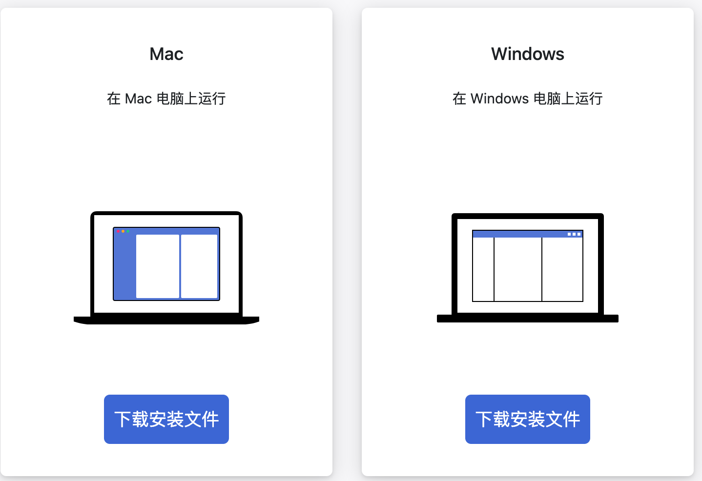
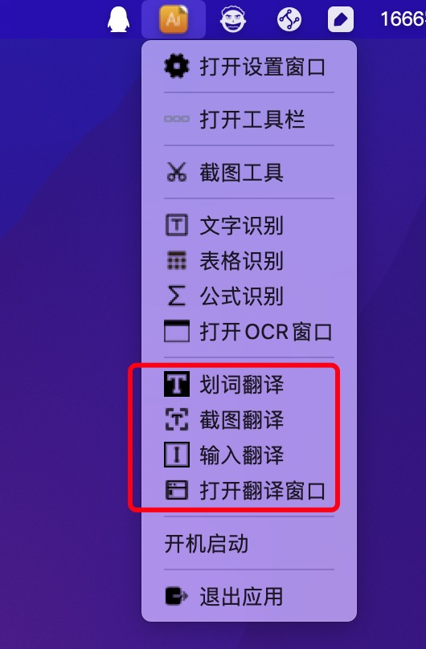
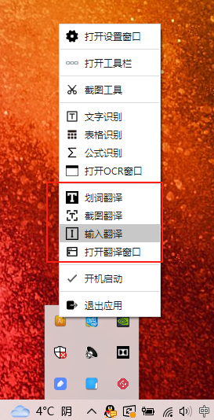
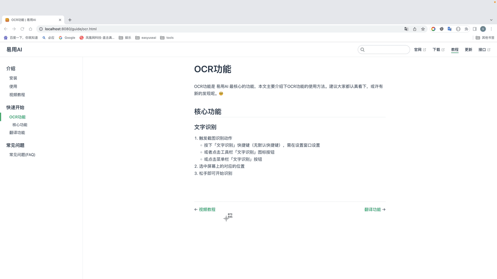
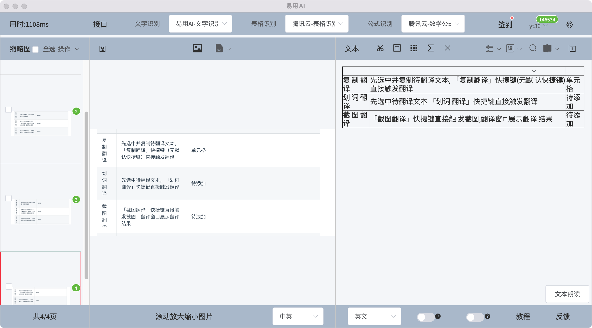
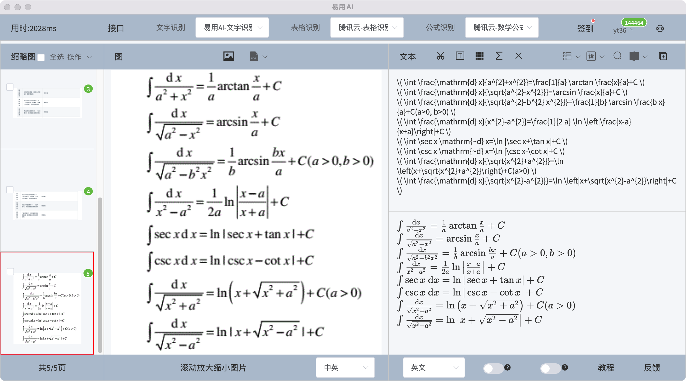
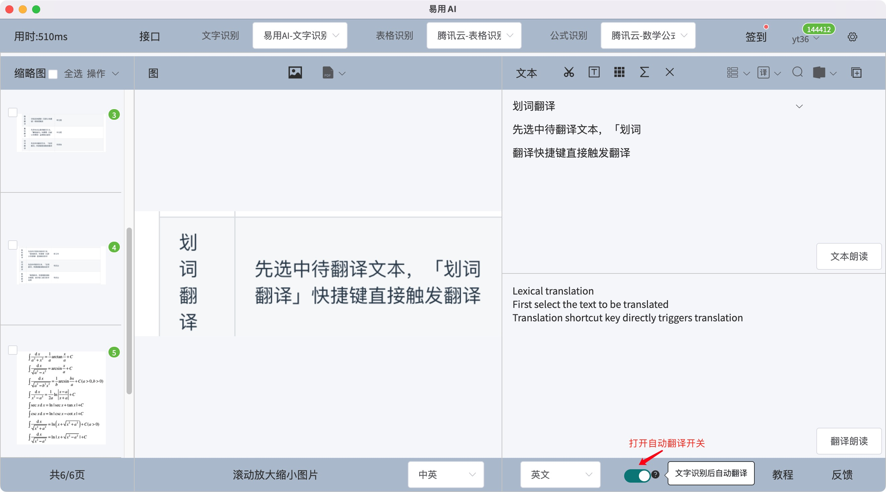

  

# 易用AI

[易用AI](http://easyuseai.com)是一款跨平台OCR和翻译软件

OCR 功能：

- [x] 文字识别
- [x] 表格识别
- [x] 公式识别
- [x] 截图 OCR
- [x] 静默截图 OCR
- [x] 离线识别
- [x] 批量识别
- [x] 本地图片识别
- [x] 本地PDF识别
- [x] 导出Word
- [x] 自动复制
- [x] 智能分段

翻译功能：

- [x] 划词翻译
- [x] 截图翻译
- [x] 输入翻译
- [x] 识别后翻译
- [x] 自动识别语种
- [x] 驼峰拆分、蛇形拆分

## 安装
[官网下载](http://easyuseai.com)

<!--  -->

## 使用方法
详细使用方法请直接查看文档 [👉 点此跳转文档](https://docs.easyuseai.com)

[易用AI](http://easyuseai.com) 是一个菜单栏软件，启动之后，菜单栏会出现一个图标，点击菜单选项即可触发相应的功能，如下所示：

### Mac 托盘菜单
<!--  -->

### Win 托盘菜单
<!--  -->

### OCR 功能

**文字识别**

1. 触发截图识别动作
    - 按下「文字识别」快捷键（无默认快捷键），需在设置窗口设置
    - 或者点击工具栏「文字识别」图标按钮
    - 或点击菜单栏「文字识别」按钮
2. 选中屏幕上的对应的位置
3. 松手即可开始识别

**表格识别**
1. 触发截图识别动作
    - 按下「表格识别」快捷键（无默认快捷键），需在设置窗口设置
    - 或者点击工具栏「表格识别」图标按钮
    - 或点击菜单栏「表格识别」按钮
2. 选中屏幕上的对应的位置
3. 松手即可开始识别

**公式识别**
1. 触发截图识别动作
    - 按下「公式识别」快捷键（无默认快捷键），需在设置窗口设置
    - 或者点击工具栏「公式识别」图标按钮
    - 或点击菜单栏「公式识别」按钮
2. 选中屏幕上的对应的位置
3. 松手即可开始识别

**批量导入本地图片**
1. 触发「导入本地图片」按钮
2. 选择本地图片
3. 在缩略图列批量选中或批量切换接口后再批量识别

**导入本地PDF**
::: tip 提示
一般导入分辨率越高，PDF转成的图片质量越高，识别结果越好，但转换和识别过程也会越慢
:::
1. 触发「导入本地PDF」下拉选项，选择一种导入分辨率
2. 选择本地PDF文件
3. 在缩略图列批量选中或批量切换接口后再批量识别

**导出Word**
以上识别类型和方式的识别结果都可以导出当前一页或所有页为Word文档

### 翻译功能
|  类型   | 描述  | 预览  |
|  ----  | ----  |----  |
| 自动翻译  | 打开「自动翻译」开关，识别后自动翻译 ||
| 触发翻译  | 识别后按下「翻译」快捷键（无默认快捷键）或「翻译」按钮触发 |效果同上|
| 复制翻译  | 先选中并复制待翻译文本，按下「复制翻译」快捷键（无默认快捷键）直接触发翻译  |效果同上 |
| 划词翻译  | 先选中待翻译文本，「划词翻译」快捷键直接触发翻译 | |
| 截图翻译  |「截图翻译」快捷键直接触发截图，翻译窗口展示翻译结果 |  |
| 输入翻译  | 在翻译窗口输入翻译文本，点击「输入翻译」按钮触发 |  |

## 总结
**易用AI，帮您更好地使用各大AI平台的能力**

目前支持腾讯云，百度，阿里，科大讯飞，有道，Mathpix，彩云小译，DeepL等多家AI平台

文字识别，表格识别，公式识别，批量识别，PDF转Word等多平台OCR功能

划词翻译，截图翻译，输入翻译等多平台对比翻译功能

一般不用但可以多平台注册，方便切换接口。
## 最后

易用AI 不是开源软件，目前本仓库主要用于提供反馈渠道。

[👉 点此查看联系方式](https://docs.easyuseai.com/general/contact.html)
