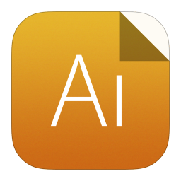

  

# 易用AI

易用AI是一款跨平台OCR和翻译软件

OCR 功能：

- [x] 文字识别
- [x] 表格识别
- [x] 公式识别
- [x] 截图 OCR
- [x] 静默截图 OCR
- [x] 离线识别
- [x] 批量识别
- [x] 本地图片识别
- [x] 本地PDF识别
- [x] 导出Word
- [x] 自动复制
- [x] 智能分段

翻译功能：

- [x] 划词翻译
- [x] 截图翻译
- [x] 输入翻译
- [x] 识别后翻译
- [x] 自动识别语种
- [x] 驼峰拆分、蛇形拆分

## 安装
[官网下载](http://easyuseai.com)

<!--  -->

## 使用方法
详细使用方法请直接查看文档 [👉 点此跳转文档](https://docs.easyuseai.com)

易用AI 是一个菜单栏软件，启动之后，菜单栏会出现一个图标，点击菜单选项即可触发相应的功能，如下所示：

### Mac 托盘菜单
<!--  -->

### Win 托盘菜单
<!--  -->

### OCR 功能

**文字识别**

1. 触发截图识别动作
    - 按下「文字识别」快捷键（无默认快捷键），需在设置窗口设置
    - 或者点击工具栏「文字识别」图标按钮
    - 或点击菜单栏「文字识别」按钮
2. 选中屏幕上的对应的位置
3. 松手即可开始识别

## 帮您更好地使用各大AI平台的能力
### 目前支持腾讯云，百度，阿里，科大讯飞，有道，搜狗，Mathpix等多家AI平台
#### 文字识别，表格识别，公式识别，批量识别，PDF转Word。不用多平台注册，方便切换接口。QQ群: 369653532

## 相比天若OCR,PandaOCR 等竞品，跨平台支持Mac，不用注册（但可选）各平台账号密匙

### 后续版本规划使用PaddleOCR，tesseract等开源库实现本地OCR功能。

## 教程
https://docs.easyuseai.com/guide
